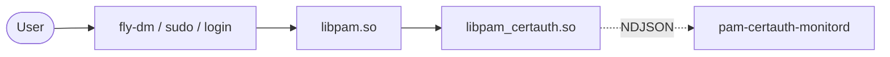

# pam_certauth — USB-token certificate authentication for Astra Linux SE

> Russian translation: [README.ru.md](README.ru.md). Detailed
> reference docs in [docs/](docs/) are Russian-primary; this README is
> the English entry point.

`pam_certauth` is a PAM module for Astra Linux SE 1.7+ that replaces
password-based authentication with X.509 certificate verification. The
private key lives on a USB token (Rutoken EDS 2.0/3.0 via PKCS#11,
JaCarta GOST-2 via PKCS#11) or, for development setups, in a
passphrase-protected `.p12` on a USB filesystem.

## Capabilities

- X.509 certificate authentication via PKCS#11 token or PKCS#12 file.
- GOST R 34.10-2012 (256/512) and Streebog via Astra's `gost-engine`.
- RSA / ECDSA via OpenSSL for mixed environments.
- Host binding through per-cert X.509 v3 extensions — a stolen token on
  another machine does not work.
- USB-removal monitoring via udev plus automatic
  lock/logout/shutdown via `systemd-logind` D-Bus.
- Correct suspend/resume handling with a configurable grace window.
- Integration with `fly-dm`, `sudo`, `login`, `gdm`.
- CRL and/or OCSP revocation with offline cache for air-gapped
  environments.
- Reproducible build: byte-identical `.deb` rebuilds.

## Supported operating systems

| OS                                              | Version           | Status                                                       |
|-------------------------------------------------|-------------------|--------------------------------------------------------------|
| Astra Linux SE                                  | 1.7, 1.7.5, 1.7.6 | Primary target, smoke-tested in a VM.                        |
| Astra Linux CE «Орёл»                           | 2.12              | Supported, smoke-tested.                                     |
| Astra Linux SE «Воронеж» / «Смоленск»           | 1.7+              | Supported via compatible packages.                           |
| Ubuntu                                          | 22.04 LTS         | Best-effort, no GOST (no certified `gost-engine`).           |
| Debian                                          | 12 «bookworm»     | Best-effort, no GOST.                                        |

## Supported tokens

- Rutoken EDS 2.0/3.0 — PKCS#11 module `librtpkcs11ecp.so`.
- JaCarta GOST-2 — PKCS#11 module `libjcPKCS11.so`.
- eToken Pro / 5110 — best-effort, no GOST.
- USB-filesystem + `.p12` (Mode A) — software-protected key only.

## Architecture (one-picture)



Detailed architecture: [docs/architecture.md](docs/architecture.md)
(Russian).

## Install

```bash
sudo apt install ./pam-certauth_0.1.0-1_amd64.deb
```

Dependencies (`gost-engine`, `pcsc-lite`, `libssl3`) are pulled in by
APT. Full step-by-step walkthrough: [docs/install.md](docs/install.md)
(Russian).

## Quick start (10-minute test bench)

A 12-step quick-start scenario for a clean Astra Linux SE 1.7.5 VM is
provided in [README.ru.md](README.ru.md#быстрый-старт-за-10-минут-тестовый-стенд).
It covers test CA generation, issuing a test cert for
`alice`, mounting it on a USB stick, configuring `/etc/pam_certauth/`,
enabling the monitord service, integrating `/etc/pam.d/sudo`, and
validating with `pamtester`.

## Project structure

```
.
├─ Cargo.toml                 # workspace manifest
├─ README.md                  # this file (English, primary)
├─ README.ru.md               # Russian translation
├─ crates/
│   ├─ pam_certauth/          # cdylib libpam_certauth.so
│   ├─ pam_certauth_core/     # synchronous core
│   ├─ pam_certauth_proto/    # IPC wire protocol
│   └─ pam_certauth_monitord/ # pam-certauth-monitord daemon
├─ debian/                    # Debian packaging
├─ dist/                      # example configs, systemd unit, integrate-pam.sh
├─ docs/                      # documentation (Russian)
└─ scripts/                   # build + checksum + reproducibility scripts
```

Documentation index: [docs/index.md](docs/index.md) (Russian).

## License

Apache License 2.0 — see [LICENSE](LICENSE).

## Maintainer contact

- Repository: <https://github.com/your-org/pam_certauth>.
- Bug tracker: GitHub Issues.
