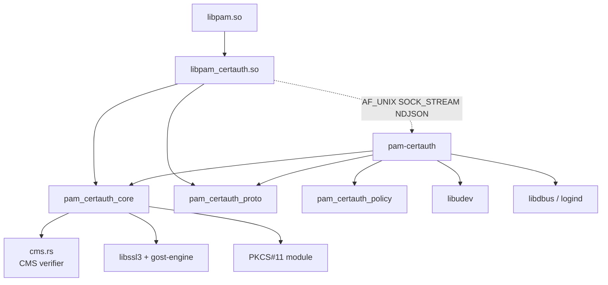
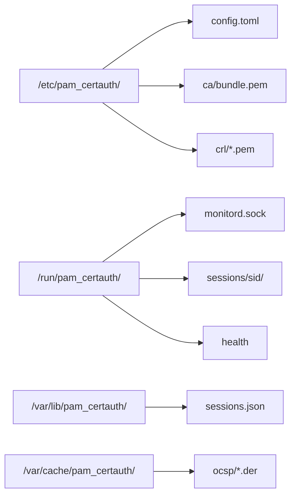
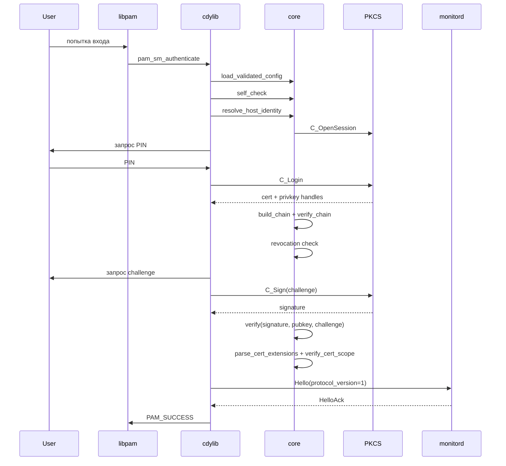
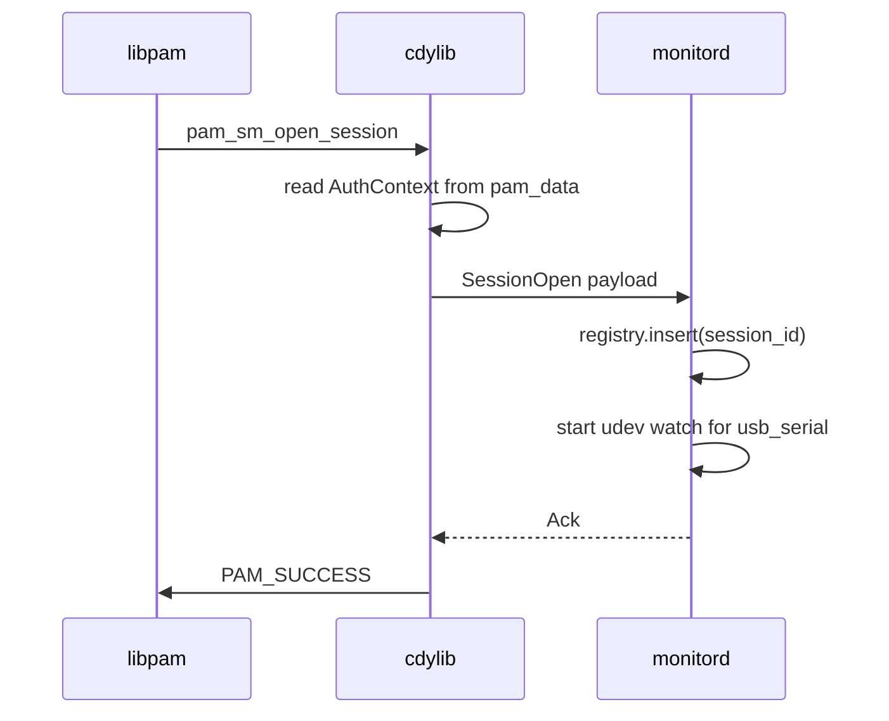
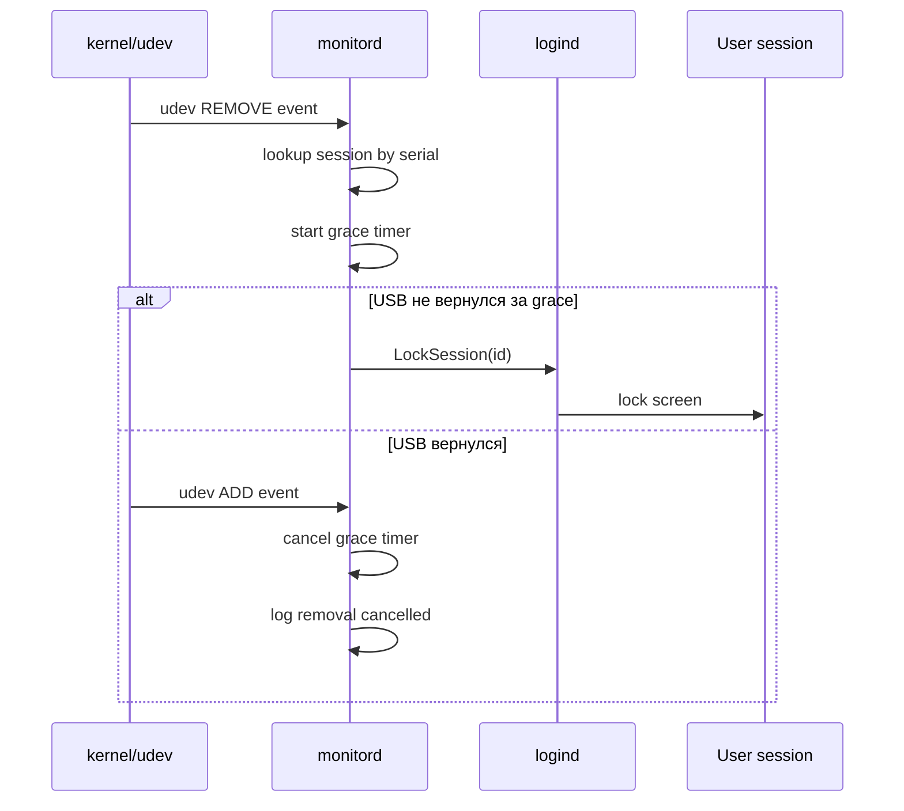
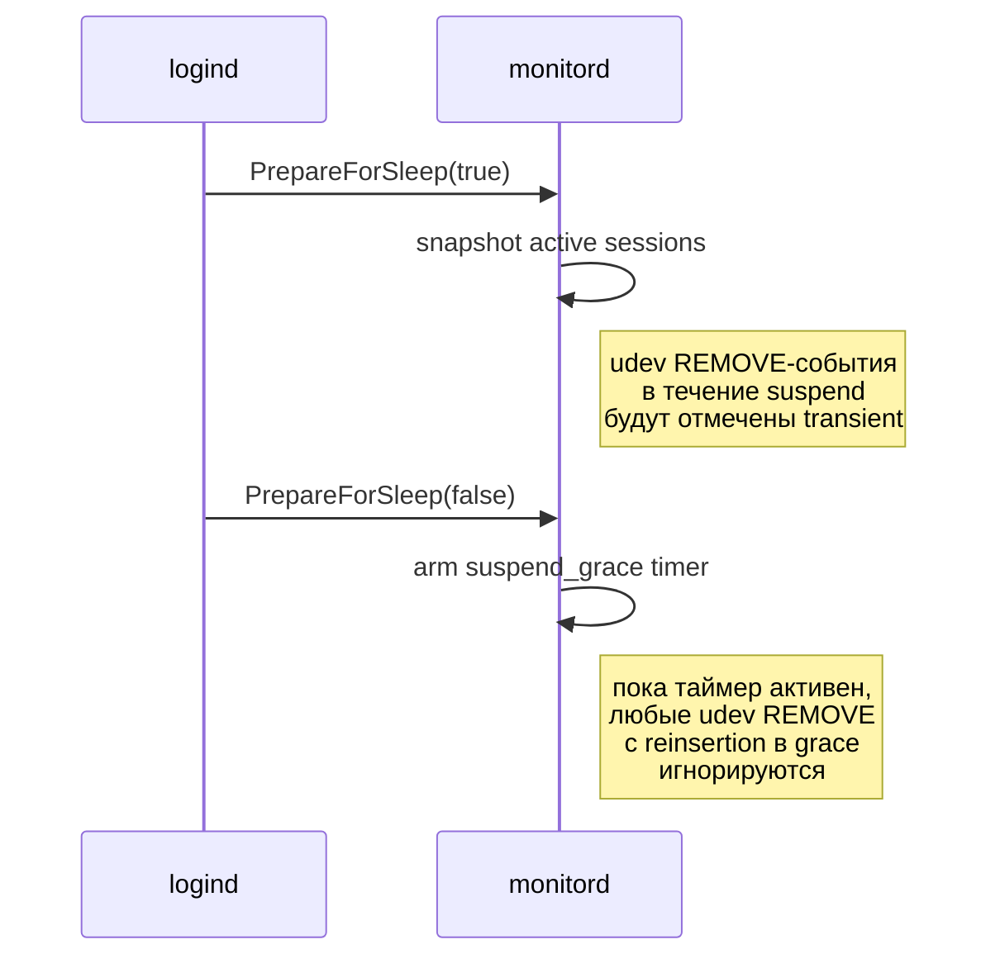

# Архитектура pam_certauth

Этот документ — единая ссылочная архитектура версии 0.1.1. После
прочтения инженер должен корректно отвечать на вопросы:

- что происходит при вызове `pam_sm_authenticate`?
- что лежит в `/run/pam_certauth/`?
- что делает `monitord` при udev REMOVE-событии?
- как сериализуется IPC и какие сообщения проходят между PAM-модулем
  и `monitord`?

## 1. Цели и не-цели

### 1.1 Что pam_certauth делает

- Аутентифицирует локального UNIX-пользователя по X.509-сертификату на
  USB-носителе или PKCS#11-токене.
- Привязывает пользователя к машине (host-binding) через X.509 v3
  расширения `pam_cert_host_binding` и `pam_cert_user_binding`,
  встроенные в сам leaf-сертификат.
- Мониторит состояние USB-носителя в течение сессии и реагирует на
  его извлечение (lock / logout / hook / shutdown).
- Корректно обрабатывает suspend/resume.
- Делегирует ГОСТ-криптографию сертифицированному `gost-engine`.

### 1.1.1 Архитектурная цель: на ATM нет интерактивного root

Развёртывание `pam_certauth` спроектировано так, чтобы на банкоматной
машине **отсутствовал** интерактивно-доступный root-аккаунт. Инженеры
заходят как обычные пользователи (нет членства в `sudo` / `wheel` /
`admin`), а все привилегированные операции проходят через
`pam-certauth execute`, который открывает повышение только после
успешной валидации CMS-подписи M-of-N одобряющих против
`policy.toml`. Sudoers содержит **единственное** узкое правило для
инженеров:

```text
# /etc/sudoers.d/pam-certauth-execute
%atm_engineers ALL=(root) NOPASSWD: /usr/bin/pam-certauth execute *
```

В отличие от классической модели «админ + `NOPASSWD: ALL`», здесь
sudoers сам по себе **не даёт** ни одной осмысленной команды от root —
любое действие требует подписанного work order. Каждый
привилегированный вызов атрибутируется минимум трём людям (инженер +
≥`M` одобряющих), что делает аудит и подотчётность встроенными
свойствами архитектуры. Подробнее — в
[threat-model.md §1.2](threat-model.md), sequence — в §9.1 ниже.

### 1.2 Что pam_certauth НЕ делает

- Не реализует свою криптографию (всё через OpenSSL и `gost-engine`).
- Не управляет жизненным циклом CA (выпуск/отзыв сертификатов — задача
  внешнего УЦ).
- Не управляет PIN-кодами токенов (это задача администратора и
  пользователя).
- Не защищает от компрометации root-аккаунта или ядра ОС (вне TOE).
- Не выполняет сетевых TLS-handshake'ов (только OCSP-запросы при
  включённой revocation).

Полное описание границ TOE — в [docs/threat-model.md](threat-model.md).

## 2. Компоненты

`pam_certauth` — это workspace из четырёх крейтов и одна
ОС-интеграция (systemd, udev, logind).

### 2.1 `pam_certauth_core` (rlib)

Синхронное ядро. Содержит:

- Загрузку и валидацию конфигурации (`config::raw::RawConfig` →
  `config::validated::ValidatedConfig`).
- Парсинг и проверку X.509 (`x509/`).
- Цепочки доверия и проверку CRL/OCSP (`trust/`, `crl/`).
- Challenge-response (`challenge/`).
- ГОСТ-делегацию через `gost-engine` (`gost/`).
- PKCS#12 и PKCS#11 (`pkcs12/`, `token/`).
- USB-mount и MountGuard RAII (`usb/`, `mount/`).
- Хуки (`hooks/`).
- Host identity chain (`host_identity/`).
- Cert-scope verification — парсинг расширений
  `pam_cert_host_binding` / `pam_cert_user_binding` и сверка их
  записей с `host_id_hash` и `pam_user` (`x509/`, `verify_cert_scope`).
- IPC client side (`ipc/`).

Без `tokio`, без асинхронности. Все операции блокирующие — это
оправдано: PAM-модуль вызывается из синхронного контекста libpam.

### 2.2 `pam_certauth_proto` (rlib)

Wire-протокол IPC между PAM-модулем и демоном. Содержит:

- `ClientMessage` и `ServerMessage` — варианты сообщений
  (`crates/pam_certauth_proto/src/client.rs`, `.../server.rs`).
- `WireError` и encode/decode-функции (`wire.rs`).
- `framing::FramingError` — кадрирование NDJSON.
- `SessionTarget` — кодирует tty/display/logind-id для конкретной
  сессии.
- `PROTOCOL_VERSION` — текущее значение `1`.

`#![forbid(unsafe_code)]` — крейт чисто-safe.

### 2.3 `pam_certauth` (cdylib `libpam_certauth.so`)

PAM service module. Содержит:

- PAM entry points: `pam_sm_authenticate`, `pam_sm_setcred`,
  `pam_sm_acct_mgmt`, `pam_sm_open_session`, `pam_sm_close_session`
  (см. [`crates/pam_certauth/src/entry.rs`](../crates/pam_certauth/src/entry.rs)).
- Panic guard (`panic_guard.rs`) — каждая C-граница защищена
  `catch_unwind`, panic → `PAM_AUTHINFO_UNAVAIL`.
- DI wiring (`di.rs`) — собирает зависимости ядра из конфига.
- Flow orchestrator (`flow.rs`) — основной авторизационный пайплайн.
- PAM conversation helpers (`pam_conv.rs`).
- Persistent data между `pam_sm_*` вызовами (`pam_data.rs`).

Билдится в `/lib/security/pam_certauth.so` (см.
[`debian/rules`](../debian/rules)).

### 2.4 `pam_certauth_cli` (бинарь `pam-certauth`)

Долгоживущий демон, владеющий:

- Сокетом IPC (`/run/pam_certauth/monitord.sock`).
- udev-мониторингом USB-устройств (`udev_monitor.rs`).
- D-Bus подключением к `systemd-logind` (`logind.rs`).
- Реестром активных сессий (`registry.rs`, `state.rs`).

Основан на `tokio` multi-thread (см. `main.rs`). Использует
`sd_notify` для интеграции с systemd `Type=notify`. Билдится в
`/usr/bin/pam-certauth` и поставляется юнитом
[`pam-certauth.service`](../dist/systemd/pam-certauth.service).

### 2.4.1 `pam_certauth_policy` (rlib, 0.2.0)

Парсер `policy.toml` + резолвер правил scope. Без зависимостей от
`pam_certauth_core` и `pam_certauth_proto` — чисто данные. См.
[crates/pam_certauth_policy](../crates/pam_certauth_policy/src/lib.rs)
и [docs/policy.md](policy.md).

### 2.4.2 Subcommands `pam-certauth` (0.2.0)

Бинарь `pam-certauth` теперь мульти-команда:

- `pam-certauth daemon` — старый monitord (по умолчанию для systemd).
- `pam-certauth execute --scope=… --work-order=… -- cmd args` —
  запуск привилегированной операции под защитой CMS work order.
  См. [docs/execute.md](execute.md).
- `pam-certauth policy validate --path=…` — синтаксис + правила
  `policy.toml`.
- `pam-certauth policy explain --scope=…` — какое правило применится
  для конкретного scope.
- `pam-certauth gc --retention-days=90` — сборка CMS-артефактов в
  `/var/lib/pam_certauth/work_orders/`. Триггер — systemd-timer.

Модуль `crates/pam_certauth_core/src/cms.rs` — CMS work order
verifier, используемый из `execute`.

### 2.5 Внешние зависимости

| Компонент             | Источник                              | Доверие                                       |
|-----------------------|---------------------------------------|-----------------------------------------------|
| `libpam0g`            | системный, Astra/Debian repo          | да                                            |
| `libssl3`             | системный, Astra/Debian repo          | да                                            |
| `gost-engine`         | Astra SE 1.7+ (СКЗИ ФСБ)              | да (в составе сертифицированной ОС)           |
| `librtpkcs11ecp.so`   | Рутокен, поставляется отдельно        | да (СКЗИ ФСБ)                                 |
| `libjcPKCS11.so`      | JaCarta, поставляется отдельно        | да (СКЗИ ФСБ)                                 |
| `libudev1`            | системный, Astra/Debian repo          | да                                            |
| `libdbus-1-3`         | системный, Astra/Debian repo          | да                                            |
| `libsystemd0`         | системный, Astra/Debian repo          | да                                            |

## 3. Crate dependency diagram



## 4. Жизненный цикл PAM-вызовов

PAM-стек делает несколько вызовов в порядке `auth → account → session`.
`pam_certauth` обрабатывает их все, но реальная работа — в
`pam_sm_authenticate`. Остальные читают сохранённый
`AuthContext` из PAM data.

### 4.1 `pam_sm_authenticate`

1. Распаковать аргументы модуля (`config=...`).
2. Загрузить и валидировать `config.toml` (через
   `pam_certauth_core::config::load_validated_config`). При ошибке —
   `PAM_AUTHINFO_UNAVAIL`.
3. Запустить `self_check` (engine, paths, hooks placeholders). При
   ошибке — `PAM_AUTHINFO_UNAVAIL`.
4. Прочитать `PAM_USER`, `PAM_SERVICE`, `PAM_TTY` из libpam.
5. Через `di::wire` собрать DI-граф (mount, trust, token).
6. Резолвить `host_id` через цепочку источников из конфига и вычислить
   `host_id_hash = sha256(host_id)`.
7. Запустить `flow::authenticate(ctx)`:
   - смонтировать USB или открыть PKCS#11-сессию;
   - найти сертификат, проверить цепь и revocation;
   - challenge-response с приватным ключом;
   - извлечь расширения `pam_cert_host_binding` и
     `pam_cert_user_binding` из leaf-сертификата и сверить их с
     `host_id_hash` и `pam_user` через `verify_cert_scope`.
     **Когда `pam_cert_user_binding` присутствует, это единственный
     источник авторизации для PAM-пользователя**; список
     `[[user_mapping]]` из `config.toml` в этом случае не читается.
     Если `pam_cert_user_binding` отсутствует — модуль откатывается
     на legacy-сравнение через `[[user_mapping]]`. Поведение
     зафиксировано тестом в
     `crates/pam_certauth/tests/negative_auth.rs` на фикстуре
     `leaf_no_user_binding` (см. также unit-тест в
     `crates/pam_certauth/src/flow.rs`).
8. При успехе — построить `AuthContext` и сохранить через
   `pam_set_data`.
9. Отправить `Hello` + `SessionOpen` в monitord (получить `Ack`).
10. Вернуть `PAM_SUCCESS`. Любая ошибка → `PAM_AUTH_ERR` или
    `PAM_AUTHINFO_UNAVAIL` (по семантике
    [`flow::FlowError`](../crates/pam_certauth/src/flow.rs)).

### 4.2 `pam_sm_setcred`

Не делает ничего сверх `PAM_SUCCESS`. Сертификаты не размещаются в
keyring пользователя.

### 4.3 `pam_sm_acct_mgmt`

Читает `AuthContext`, проверяет, что:

- `notAfter` сертификата ещё не истёк (с допуском
  `clock_skew_seconds`).

При несоответствии возвращает `PAM_ACCT_EXPIRED`.

### 4.4 `pam_sm_open_session`

Читает `AuthContext`. Отправляет в monitord `SessionOpen` с полным
payload'ом (см. `client.rs::SessionOpenPayload`):

- `session_id` (UUID);
- `pam_user`, `pam_service`;
- `target` (Tty / Display / LogindSession);
- `usb_serial` — серийник носителя, авторизовавшего сессию;
- `host_id_hash` — hex SHA-256 от `host_id`;
- `opened_at` — wall-clock unix-время;
- `cert_cn`, `cert_serial`.

Monitord добавляет сессию в реестр и начинает мониторинг USB.

### 4.5 `pam_sm_close_session`

Отправляет `SessionClose { session_id, closed_at }`. Monitord удаляет
сессию из реестра и **не** триггерит `on_usb_removed` — пользователь
явно завершил сессию.

## 5. Файловая раскладка во время работы



| Путь                                         | Кто пишет                | Кто читает                     | Права                  |
|----------------------------------------------|--------------------------|--------------------------------|------------------------|
| `/etc/pam_certauth/config.toml`              | администратор            | cdylib + monitord              | `0640 root:root`       |
| `/etc/pam_certauth/ca/bundle.pem`            | администратор            | cdylib + monitord              | `0640 root:root`       |
| `/run/pam_certauth/monitord.sock`            | monitord                 | cdylib                         | `0660 root:pam-certauth` |
| `/run/pam_certauth/sessions/<sid>/`          | cdylib                   | удаляет MountGuard на drop     | `0700 root:root`       |
| `/run/pam_certauth/health`                   | monitord                 | внешний мониторинг             | `0644 root:root`       |
| `/var/lib/pam_certauth/sessions.json`        | monitord                 | monitord (между запусками)     | `0600 root:root`       |
| `/var/cache/pam_certauth/ocsp/*.der`         | core                     | core                           | `0640 root:root`       |

`/run/pam_certauth/` и `/var/lib/pam_certauth/` создаются systemd
через директивы `RuntimeDirectory` и `StateDirectory` юнита
(см. [`pam-certauth.service`](../dist/systemd/pam-certauth.service)
и [`dist/tmpfiles/pam-certauth.conf`](../dist/tmpfiles/pam-certauth.conf)).

## 6. Sequence diagram — `pam_sm_authenticate` happy path с PKCS#11



## 7. Sequence diagram — `pam_sm_open_session` + IPC `SessionOpen`



## 8. Sequence diagram — USB removal → grace → lock



Поведение `on_usb_removed`:

- `"lock"` — `LockSession` (по умолчанию).
- `"logout"` — `TerminateSession`.
- `"hook"` — выполняется хук `usb_removed`.
- `"shutdown"` — `PowerOff` через D-Bus к logind.

## 9. Sequence diagram — suspend / resume



При `monitor_fail_mode = "strict"` cdylib ожидает `Ack` от monitord
по таймауту; при `"permissive"` — переживает кратковременную
недоступность.

## 9.1 Sequence diagram — `pam-certauth execute` (0.2.0)

```mermaid
sequenceDiagram
    participant O as Оператор (sudo)
    participant E as pam-certauth execute
    participant M as monitord
    participant FS as filesystem
    participant Cmd as Child process

    O->>E: argv: --scope=X --work-order=wo.cms -- cmd
    E->>E: 1. clap parse
    E->>FS: 2. read config.toml + policy.toml
    E->>E: 2.1 sha256(policy.toml) → audit field
    E->>M: 3. Hello + GetActiveSessionByUid(uid)
    M-->>E: ActiveSession{engineer_ski, scopes, ...}
    E->>FS: 4. open(wo.cms, O_NOFOLLOW); read; hash-before
    E->>FS: 4.1 read again; hash-after; assert equal (TOCTOU)
    E->>E: 5. CMS verify via approver_trust
    E->>E: 6. argv canonicalize (reject NUL, control, --)
    E->>E: 7. (опц.) read .pattern + regex match
    E->>E: 8. pre_hooks
    E->>E: 9. audit: pam_certauth.execute.start
    E->>Cmd: 10. fork + setpgid + exec
    par signals
        O-->>E: SIGINT/TERM/HUP/...
        E->>Cmd: kill(-pgrp, signal)
    and watchdog
        E->>Cmd: (timeout) SIGTERM → 5s → SIGKILL → exit 124
    end
    Cmd-->>E: 11. waitpid → exit code
    E->>E: 12. audit: pam_certauth.execute.done
    E->>E: 13. post_hooks (audit_critical → escalate)
    E->>FS: 14. retain wo.cms at /var/lib/pam_certauth/work_orders/<sha>.cms
    E-->>O: exit code (child / 124 / 2 / 126)
```

## 10. IPC wire protocol

### 10.1 Транспорт

- `AF_UNIX` SOCK_STREAM.
- Путь сокета: `/run/pam_certauth/monitord.sock`.
- Права: `0660 root:pam-certauth` (см. tmpfiles + systemd
  RuntimeDirectory).
- Аутентификация peer'а: `SO_PEERCRED` — monitord проверяет, что
  `uid == 0`. Любой иной peer закрывается.
- Реализация: [`crates/pam_certauth_cli/src/peercred.rs`](../crates/pam_certauth_cli/src/peercred.rs).

### 10.2 Кадрирование

Newline-delimited JSON (NDJSON):

- каждый кадр — единственная строка UTF-8 JSON;
- терминатор — единственный байт `\n`;
- максимальный размер кадра — `MAX_FRAME_BYTES = 64 KiB` (см.
  [`crates/pam_certauth_proto/src/wire.rs`](../crates/pam_certauth_proto/src/wire.rs)).

Обоснование выбора NDJSON:

- стандартные tools (jq, journalctl-форматер) умеют обрабатывать его
  без специальной поддержки;
- кадрирование тривиально — `\n`-deliмитер;
- расходы на парсинг JSON оправданы низкой частотой сообщений (≤ 10
  в секунду в типовом дне).

### 10.3 Версионирование

- `PROTOCOL_VERSION: u32 = 2` (0.2.0; 0.1.x использовал `1`) (см.
  [`crates/pam_certauth_proto/src/version.rs`](../crates/pam_certauth_proto/src/version.rs)).
- Первый кадр на любом соединении — `Hello { protocol_version }`.
- Если `protocol_version` не равен серверному, monitord отвечает
  `Error { code: 1000 (PROTOCOL_MISMATCH) }` и закрывает соединение.
- Семантика версий: MAJOR-mismatch → разрыв; MINOR (если появятся) —
  best-effort backward compatibility.

> Полный список сообщений v2 (`GetActiveSessionByUid`,
> `ActiveSession`, новые поля `SessionOpen`) — в
> [docs/ipc.md](ipc.md).

### 10.4 Сообщения

#### Client → Server (`ClientMessage`)

Из [`crates/pam_certauth_proto/src/client.rs`](../crates/pam_certauth_proto/src/client.rs):

```json
{"type": "hello", "protocol_version": 1, "agent": "libpam_certauth/0.1.1"}
```

```json
{"type": "session_open", "session_id": "1c5e8a90-3b6f-4a1d-9c2e-77f0b1c2d3e4", "pam_user": "alice", "pam_service": "sudo", "target": {"kind": "logind_session", "id": "12"}, "usb_serial": "RUTOKEN-001", "host_id_hash": "ee0bd4f3a3c8e21d4a2b1c0d9e8f7a6b5c4d3e2f1a0b9c8d7e6f5a4b3c2d1e0f", "opened_at": 1735689600, "cert_cn": "Alice", "cert_serial": "01a2b3c4d5e6f70809"}
```

```json
{"type": "session_close", "session_id": "1c5e8a90-3b6f-4a1d-9c2e-77f0b1c2d3e4", "closed_at": 1735689700}
```

```json
{"type": "ping"}
```

#### Server → Client (`ServerMessage`)

Из [`crates/pam_certauth_proto/src/server.rs`](../crates/pam_certauth_proto/src/server.rs):

```json
{"type": "hello_ack", "server_version": "0.1.1", "protocol_version": 1}
```

```json
{"type": "ack"}
```

```json
{"type": "pong"}
```

```json
{"type": "error", "code": 1000, "message": "protocol version mismatch"}
```

### 10.5 Таблица «инициатор → получатель → ответ → таймаут»

| Initiator | Сообщение         | Получатель | Ожидаемый ответ        | Таймаут | Действие при timeout         |
|-----------|-------------------|------------|------------------------|---------|------------------------------|
| client    | `Hello`           | server     | `HelloAck` или `Error` | 2 сек   | разрыв соединения            |
| client    | `SessionOpen`     | server     | `Ack` или `Error`      | 2 сек   | согласно `monitor_fail_mode` |
| client    | `SessionClose`    | server     | `Ack`                  | 1 сек   | log + продолжить             |
| client    | `Ping`            | server     | `Pong`                 | 1 сек   | log + продолжить             |

### 10.6 Коды ошибок

Из [`crates/pam_certauth_proto/src/server.rs`](../crates/pam_certauth_proto/src/server.rs):

| Код  | Имя                | Семантика                                                     | Действие cdylib                |
|------|--------------------|---------------------------------------------------------------|--------------------------------|
| 1000 | PROTOCOL_MISMATCH  | Версии протокола не совпали.                                   | fail-closed                    |
| 1001 | DEVICE_GONE        | USB-устройство по `usb_serial` отсутствует.                    | fail-closed                    |
| 1003 | UNAUTHORIZED       | Peer не uid=0 (по `SO_PEERCRED`).                              | разрыв                         |
| 1100 | BAD_REQUEST        | Невалидный кадр (нарушение схемы).                             | разрыв + log                   |
| 1500 | INTERNAL           | Внутренняя ошибка демона.                                      | по `monitor_fail_mode`         |

`PROTOCOL_MISMATCH`, `DEVICE_GONE`, `UNAUTHORIZED` — всегда
fail-closed. `INTERNAL` и `BAD_REQUEST` — по политике
`monitor_fail_mode`.

### 10.7 JSON-схема `SessionOpenPayload`

```json
{
  "title": "SessionOpenPayload",
  "type": "object",
  "properties": {
    "session_id":   {"type": "string", "format": "uuid"},
    "pam_user":     {"type": "string"},
    "pam_service":  {"type": "string"},
    "target":       {"type": "object"},
    "usb_serial":   {"type": ["string", "null"]},
    "host_id_hash": {"type": "string", "pattern": "^[0-9a-f]{64}$"},
    "opened_at":    {"type": "integer"},
    "cert_cn":      {"type": "string"},
    "cert_serial":  {"type": "string", "pattern": "^[0-9a-f]+$"}
  },
  "required": ["session_id", "pam_user", "pam_service", "target", "host_id_hash", "opened_at", "cert_cn", "cert_serial"]
}
```

## 11. Threading и concurrency model

### 11.1 cdylib

- Полностью синхронный, без `tokio`.
- Соединение с monitord — единственное per `pam_sm_*` вызов;
  закрывается после ответа.
- Без shared mutable state: каждый PAM-вызов имеет собственный
  `flow::Context`.

### 11.2 monitord

- `tokio` multi-thread runtime (количество worker threads —
  по умолчанию системный default tokio).
- На каждое входящее соединение — отдельная задача
  (`server.rs::handle_connection`).
- Реестр сессий — `Mutex<RegistryStore>` (см. `registry.rs`).
- udev и logind — свои dedicated long-running tasks.
- Запись `/var/lib/pam_certauth/sessions.json` — atomic-rename через
  tempfile + flock.

### 11.3 Совместный доступ к `/run/pam_certauth/sessions/`

- cdylib создаёт каталог `<sid>` через `MountGuard::new` (RAII).
- Удаляет каталог в `Drop` (или в `pam_sm_close_session`).
- monitord не пишет в этот каталог напрямую — только читает при
  диагностике.

## 12. Host identity chain

`host_id` вычисляется в момент `pam_sm_authenticate` через цепочку
источников из секции `[host_identity]`. Реализация —
[`crates/pam_certauth_core/src/host_identity/chain.rs`](../crates/pam_certauth_core/src/host_identity/chain.rs).

Источники в порядке предпочтения:

1. `machine_id` — `/etc/machine-id` (стабилен между перезагрузками,
   меняется при переустановке).
2. `dmi_board_serial` — `/sys/class/dmi/id/board_serial` (стабилен на
   уровне железа, меняется при замене материнской платы).
3. `tpm_ek_pubhash` — публичный ключ TPM EK (самый стабильный).
4. `hostname` — `/etc/hostname` (нестабилен, легко подменяется; OK для
   тестов).
5. `custom_command` — администраторский скрипт.

Цепочка обходится в указанном `sources` порядке. Первый непустой
результат — победитель. Если все источники пустые:

- `fallback = "deny"` → `PAM_AUTH_ERR` (production по умолчанию);
- `fallback = "warn"` → `PAM_SUCCESS` с warning-логом (тестовое окружение);
- `fallback = "allow"` → `PAM_SUCCESS` молча (опасно, не использовать).

## 13. Fail-closed правила

| #  | Условие                                                       | Возврат                |
|----|---------------------------------------------------------------|------------------------|
| 1  | panic в любом `pam_sm_*`                                       | `PAM_AUTHINFO_UNAVAIL` |
| 2  | загрузка `config.toml` упала                                   | `PAM_AUTHINFO_UNAVAIL` |
| 3  | `self_check` упал (engine, paths, hooks)                       | `PAM_AUTHINFO_UNAVAIL` |
| 4  | `host_id` не получен и `fallback = "deny"`                    | `PAM_AUTH_ERR`         |
| 5  | сертификат не проходит chain verification                      | `PAM_AUTH_ERR`         |
| 6  | revocation check невозможен (`mode = "ocsp"`, OCSP недоступен)| `PAM_AUTH_ERR`         |
| 7  | challenge-response не сошёлся                                  | `PAM_AUTH_ERR`         |
| 8  | расширение `pam_cert_host_binding` отсутствует или невалидно   | `PAM_AUTH_ERR`         |
| 9  | host_id_hash не входит в записи `pam_cert_host_binding`        | `PAM_AUTH_ERR`         |
| 10 | расширение `pam_cert_user_binding` отсутствует или невалидно   | `PAM_AUTH_ERR`         |
| 11 | `pam_user` не входит в записи `pam_cert_user_binding`          | `PAM_AUTH_ERR`         |
| 12 | monitord недоступен и `monitor_fail_mode = "strict"`           | `PAM_AUTH_ERR`         |
| 13 | любой `Error` из monitord с `code = DEVICE_GONE`              | `PAM_AUTH_ERR`         |

Принципы:

- panic'и и инфраструктурные ошибки → `PAM_AUTHINFO_UNAVAIL`
  (сообщает PAM-стеку: «следующий модуль может попробовать»).
- Бизнес-логические отказы (неверный сертификат, отсутствующие или
  не совпавшие записи в расширениях `pam_cert_host_binding` /
  `pam_cert_user_binding`) → `PAM_AUTH_ERR` (сообщает: «этот
  пользователь не прошёл»).

## 14. Журналирование `tracing` → syslog / journald

`tracing`-подписчик cdylib `pam_certauth.so` строится в момент первого
вызова `pam_sm_*` и шлёт записи в **syslog** через `LOG_AUTH` facility
с ident `pam_certauth`. На системах с journald эти строки видны через
`journalctl -t pam_certauth` и попадают в `/var/log/auth.log` (на
обычном syslog-стеке) с префиксом `pam_certauth[<pid>]:`. Это
поведение появилось в 0.1.1 (`fix(pam): wire syslog backend for
tracing subscriber`) — в 0.1.0 cdylib писал в stderr, который libpam
отбрасывал, и production-диагностика была фактически невозможна.

`pam-certauth` использует `tracing-journald` и пишет в
journald через нативный `Type=notify`-канал. На SysV-init хостах без
journald записи `tracing` уходят в stderr демона; куда они попадут
дальше — определяется тем, как init-скрипт перенаправляет stderr
(в стандартной поставке `start-stop-daemon` отдаёт stderr системному
syslog'у через `logger`).

Полная семантика того, что и на каком уровне логируется, — в
[docs/operations.md §6](operations.md).

## 15. Дальнейшее чтение

- [docs/threat-model.md](threat-model.md) — какие угрозы покрывает
  каждый из этих fail-closed правил.
- [docs/configuration.md](configuration.md) — какие поля влияют на
  поведение, описанное здесь.
- [docs/operations.md](operations.md) — как читать журнал и
  диагностировать аномалии.
