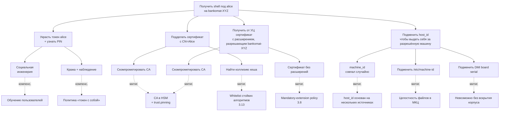

# Модель угроз pam_certauth

Каждая угроза сопровождается ссылкой на источник evidence: путь к коду,
имя поля в конфиге или ссылка на тест, доказывающий заявленное свойство.

## 1. Введение

### 1.1 Целевой объект (TOE)

Под `pam_certauth` понимается:

- PAM-модуль `libpam_certauth.so` (cdylib);
- демон `pam-certauth` (бинарь);
- крейты ядра `pam_certauth_core` и протокола `pam_certauth_proto`;
- поставочные конфигурационные файлы `dist/config/*.example`;
- systemd-юнит и tmpfiles-сниппет;
- скрипт интеграции `dist/scripts/integrate-pam.sh`.

В TOE **не входят:**

- ядро Astra Linux SE;
- libpam, libssl3, libudev, libdbus, libsystemd;
- `gost-engine` (отдельное СКЗИ ФСБ);
- PKCS#11-модули вендоров токенов (отдельные СКЗИ ФСБ);
- пользовательские хуки, прописанные в `[[hooks]]`;
- Inkscape, fly-dm, gdm и прочие потребители PAM.

### 1.2 Операционная модель: на банкомате нет интерактивного root

Ключевое архитектурное свойство развёртывания: на ATM-машине **нет
интерактивно доступного root-аккаунта** и **нет учётных записей с
`sudo -i` / `sudo bash`**. Все привилегированные действия инженеров
проходят через `pam-certauth execute`, защищённый M-of-N CMS work
order.

- Аккаунты инженеров на ATM — обычные пользователи. Они **не входят**
  в группы `wheel`, `sudo`, `admin` и не имеют ни одного broad
  sudoers-правила вида `NOPASSWD: ALL`.
- В `/etc/sudoers.d/pam-certauth-execute` есть единственное узкое
  правило:

  ```text
  %atm_engineers ALL=(root) NOPASSWD: /usr/bin/pam-certauth execute *
  ```

  Инженер может запустить **только** `pam-certauth execute` и ничего
  больше — ни `sudo -i`, ни `sudo cat`, ни `sudo bash`.
- Внутри `pam-certauth execute` повышение привилегий открывается
  **только** после успешной валидации CMS-подписи M-of-N
  одобряющих + проверки `scope` / `host` / `argv_pattern` против
  `policy.toml`. См. [execute.md](execute.md) и [policy.md](policy.md).
- Компрометация учётных данных инженера в одиночку
  (украденный токен + подсмотренный PIN) даёт **только логин на ATM**
  — никакого root-действия без `N` независимых подписей операторов
  выполнить нельзя. Эта защита — **архитектурная**, не post-hoc
  audit: вектор «получил токен → `sudo -i` → root» закрыт отсутствием
  широкого sudoers-правила, а не только подписями в журнале.
- Break-glass / recovery пути (Ansible push с bastion'а под отдельной
  identity, оффлайн-сейф с root-паролем, recovery USB с подписанным
  initramfs) — out-of-band и описаны отдельно: они **не** доступны с
  обычной сессии инженера и требуют физического доступа либо
  отдельной авторизации.

Следствие для модели угроз: угроза «lateral root из скомпрометированной
учётки инженера» (раздел 4 и атак-tree в §7) переходит из категории
«mitigated by audit» в категорию **mitigated by architecture** — на
машине просто нет команды, которую вор токена мог бы выполнить от
root без согласия `N` других операторов.

## 2. Допущения о развёртывании

| #   | Допущение                                                                                  | Почему важно                                                                            |
|-----|--------------------------------------------------------------------------------------------|------------------------------------------------------------------------------------------|
| 2.1 | Машина физически защищена (МКЦ Astra или эквивалент).                                       | Без МКЦ root-компрометация → бесполезность модуля.                                       |
| 2.2 | Целостность системы на момент установки контролируется (МКЦ + verified boot, если есть).   | Подмена `gost-engine.so` или `libpam_certauth.so` обходит модуль.                         |
| 2.3 | CA-инфраструктура работает корректно: ключи в HSM, выпуск контролируется регламентом.      | Компрометация CA private key → катастрофическая компрометация контура.                  |
| 2.4 | PIN-коды пользователей не разглашаются, не записываются на бумаге у компьютера.            | PIN — единственная защита токена при физическом доступе.                                |
| 2.5 | Сертификаты выпускаются УЦ с обязательными расширениями `pam_cert_host_binding` и `pam_cert_user_binding`. | Без расширений сертификат не авторизует ни одного пользователя ни на одном хосте — fail-closed. |
| 2.6 | Администратор имеет «backup-tty» во время правки PAM-стека.                                | Защита от lockout при ошибочной конфигурации.                                            |
| 2.7 | Резервный пользователь с парольной аутентификацией не удалён.                              | Lockout-prevention при сбое в `pam_certauth`.                                            |

## 3. Угрозы, ОТ КОТОРЫХ модуль защищает

Каждая угроза описана по схеме: описание → STRIDE-категория →
mitigation → evidence (код, конфиг, тест).

### 3.1 Подбор пароля

- **Описание:** атакующий пытается перебрать пароль локального
  пользователя.
- **STRIDE:** Spoofing.
- **Mitigation:** парольной аутентификации `pam_certauth` не
  реализует. Любая попытка ввода пароля проваливается на этапе
  `pam_conv`.
- **Evidence:** в [`crates/pam_certauth/src/entry.rs`](../crates/pam_certauth/src/entry.rs)
  отсутствует вызов `pam_authtok_get`. Аутентификация идёт через
  challenge-response с приватным ключом
  ([`crates/pam_certauth_core/src/challenge/`](../crates/pam_certauth_core/src/challenge/)).

### 3.2 Утечка пароля при подсматривании / фишинге

- **Описание:** plain text password leakage.
- **STRIDE:** Information Disclosure.
- **Mitigation:** пароля нет (см. 3.1). PIN токена не передаётся в
  PAM-стек и в журналы.
- **Evidence:** [`crates/pam_certauth_core/src/secret.rs`](../crates/pam_certauth_core/src/secret.rs)
  — обёртка `Secret<T: Zeroize>` зануляет PIN при `Drop`.
  PIN никогда не передаётся как форматный аргумент tracing-макроса
  (см. также [`crates/pam_certauth_core/src/pkcs12/`](../crates/pam_certauth_core/src/pkcs12/)).

### 3.3 Копирование сертификата с USB-носителя

- **Описание:** атакующий копирует `.p12` с чужого USB и пытается
  использовать его на своей машине.
- **STRIDE:** Spoofing.
- **Mitigation (Mode A):** `.p12` зашифрован парольной фразой; без
  фразы дешифровка невозможна. Mode A считается режимом «средней»
  защиты — для production применяется Mode B.
- **Mitigation (Mode B):** ключ non-extractable. Тест проверяет
  атрибуты `CKA_EXTRACTABLE = false`.
- **Evidence:** тест
  [`crates/pam_certauth_core/tests/pkcs11_hardware_negative.rs`](../crates/pam_certauth_core/tests/pkcs11_hardware_negative.rs)
  + [`pkcs11_integration.rs`](../crates/pam_certauth_core/tests/pkcs11_integration.rs).

### 3.4 Использование чужого токена без знания PIN

- **Описание:** атакующий получил токен (украл/подобрал на стуле), но
  PIN не знает.
- **STRIDE:** Spoofing.
- **Mitigation:** PIN-prompt через PAM conversation; после `N`
  неудачных попыток (`pkcs11_max_pin_attempts`, default `3`) модуль
  отказывает. После `N` попыток на самом токене — он блокируется на
  уровне аппаратного счётчика.
- **Evidence:** тест
  [`crates/pam_certauth_core/tests/pin_loop.rs`](../crates/pam_certauth_core/tests/pin_loop.rs)
  проверяет лимит попыток.

### 3.5 Использование валидного токена на чужой машине

- **Описание:** атакующий легально владеет токеном (или украл его), но
  пытается использовать на машине, где данный токен не разрешён.
- **STRIDE:** Spoofing + Elevation of Privilege.
- **Mitigation:** проверка X.509-расширения `pam_cert_host_binding` —
  записи в нём (`*` / `sha256:<HEX>` / raw `machine_id`) сравниваются
  с `host_id_hash = sha256(host_id)` запрашивающей машины. Если ни
  одна запись не совпала — `PAM_AUTH_ERR` (`HostNotAllowed`). Само
  расширение защищено подписью сертификата CA — изменить его без
  компрометации CA нельзя.
- **Evidence:**
  - реализация — модули `x509::host_binding_ext` и
    `verify_cert_scope` в `pam_certauth_core::x509/`;
  - end-to-end —
    [`crates/pam_certauth/tests/auth_e2e_p12.rs`](../crates/pam_certauth/tests/auth_e2e_p12.rs).

### 3.6 Использование сессии после ухода пользователя

- **Описание:** пользователь отошёл от рабочего места, не извлекая
  токен; либо извлёк, но забыл закрыть сессию.
- **STRIDE:** Tampering + Elevation of Privilege.
- **Mitigation:** мониторинг udev REMOVE-событий через monitord;
  по подтверждённому removal (с учётом `usb_removed_grace_seconds`)
  — `LockSession` или `TerminateSession` через D-Bus к logind.
- **Evidence:**
  - реализация —
    [`crates/pam_certauth_cli/src/udev_monitor.rs`](../crates/pam_certauth_cli/src/udev_monitor.rs),
    [`logind.rs`](../crates/pam_certauth_cli/src/logind.rs),
    [`actions.rs`](../crates/pam_certauth_cli/src/actions.rs);
  - тесты — [`udev_simulation.rs`](../crates/pam_certauth_cli/tests/udev_simulation.rs),
    [`udev_event_parse.rs`](../crates/pam_certauth_cli/tests/udev_event_parse.rs);
  - тесты suspend/resume —
    [`suspend_grace.rs`](../crates/pam_certauth_cli/tests/suspend_grace.rs).

### 3.6.1 Astra ЗПС (DIGSIG) и подпись бинарей

- **Описание:** атакующий с file-write правами заменяет `pam_certauth.so`
  или `pam-certauth` подделанным бинарём.
- **STRIDE:** Tampering.
- **Mitigation:**
  - На Astra Linux SE production-режим — `astra-digsig-control` в
    `enforce`. ELF-файлы из пакета `pam-certauth` должны быть
    подписаны через сборочный CI Astra-партнёра (`bsign` GPG-ключом
    из доверенной связки `/etc/digsig/keys/`); подмена бинаря без
    соответствующей подписи отвергается ядром на `execve(2)` /
    `mmap(2)`.
  - Если ЗПС переведён в `logging-only`, защита снижается до
    `dpkg --verify` и прав `0755 root:root` на бинарь — этот режим
    допустим только на dev-машинах. Production-deploy без подписи
    запрещён регламентом эксплуатации.
- **Evidence:** см. install.md §1.5 «Preflight: USBGuard и Astra ЗПС
  (DIGSIG)» — там описан и режим проверки, и команды диагностики.

### 3.7 Утечка приватного ключа из памяти процесса

- **Описание:** атакующий читает память процесса (через ptrace,
  /proc/pid/mem, минидамп) и пытается извлечь PIN или приватный ключ.
- **STRIDE:** Information Disclosure.
- **Mitigation:**
  - PIN хранится в `Secret<T: Zeroize>` — зануляется при `Drop`.
  - Приватный ключ в Mode B никогда не покидает токен (PKCS#11
    non-extractable).
  - В Mode A парольная фраза дешифровки используется единожды и
    обнуляется после `flow::authenticate`.
  - systemd unit ставит `NoNewPrivileges=yes`, `ProtectKernelTunables=yes`,
    `RestrictNamespaces=yes` — затрудняет ptrace со стороны.
- **Evidence:**
  - [`crates/pam_certauth_core/src/secret.rs`](../crates/pam_certauth_core/src/secret.rs)
    + Cargo.toml `zeroize = { version = "1.7", features = ["derive"] }`;
  - [`dist/systemd/pam-certauth.service`](../dist/systemd/pam-certauth.service)
    — все hardening-директивы в наличии.

### 3.8 Сертификат без расширений или с подделанным расширением

- **Описание:** атакующий пытается использовать сертификат, в котором
  расширений `pam_cert_host_binding` / `pam_cert_user_binding` нет
  совсем, либо пробует встраивать «подделанные» записи в обход УЦ.
- **STRIDE:** Tampering + Spoofing.
- **Mitigation:**
  - **Mandatory-extension policy:** отсутствие любого из расширений
    в leaf-сертификате — это безусловный отказ
    (`HostExtensionMissing` / `UserExtensionMissing` →
    `PAM_AUTH_ERR`). Никаких «мягких» fallback'ов нет.
  - **Защита подписью CA:** содержимое расширения покрыто подписью
    сертификата. Изменить запись без приватного ключа CA невозможно;
    подделать сертификат полностью — задача компрометации УЦ
    (см. 4.8).
  - **Проверка цепочки:** при выпуске сертификата нештатным
    «доверенным» CA срабатывает `[trust].anchors` + опционально
    `[trust.pinning]`.
  - **Повреждённое DER-кодирование** (мусор в `extnValue`) →
    `*ExtensionMalformed` → `PAM_AUTH_ERR`.
- **Evidence:**
  - реализация — `pam_certauth_core::x509::{host_binding_ext,
    user_binding_ext}` + `verify_cert_scope`;
  - таблица семантики — [docs/cert-issuance.md](cert-issuance.md).

### 3.9 Подмена `config.toml`

- **Описание:** атакующий с file-write правами заменяет `config.toml`
  на конфигурацию с ослабленным `[trust]` или отключённой revocation.
- **STRIDE:** Tampering.
- **Mitigation:**
  - `config.toml` не подписывается, но защищён правами `0640
    root:root` (см. [`debian/postinst`](../debian/postinst));
  - `dpkg --verify pam-certauth` обнаруживает изменение поставочных
    файлов (но не пользовательских правок `config.toml` после
    установки);
  - изменение конфига требует root-доступа — это уже вне модели угроз
    PAM-уровня.
- **Evidence:** [`debian/postinst`](../debian/postinst) +
  [`dist/tmpfiles/pam-certauth.conf`](../dist/tmpfiles/pam-certauth.conf).

### 3.10 MITM в IPC

- **Описание:** атакующий пытается подключиться к
  `/run/pam_certauth/monitord.sock` и подменять ответы.
- **STRIDE:** Tampering + Spoofing.
- **Mitigation:**
  - сокет в `/run/pam_certauth/` имеет права `0660 root:pam-certauth`
    (см. systemd `RuntimeDirectoryMode=0750`);
  - monitord проверяет peer'а через `SO_PEERCRED` —
    `uid != 0` → `Error { code: 1003 (UNAUTHORIZED) }` + разрыв.
- **Evidence:**
  - [`crates/pam_certauth_cli/src/peercred.rs`](../crates/pam_certauth_cli/src/peercred.rs);
  - тест [`crates/pam_certauth_cli/tests/peercred.rs`](../crates/pam_certauth_cli/tests/peercred.rs)
    + [`ipc_auth.rs`](../crates/pam_certauth_cli/tests/ipc_auth.rs).

### 3.11 Replay-атаки на challenge-response

- **Описание:** атакующий, перехвативший challenge и подпись, пытается
  предъявить их повторно на новой попытке аутентификации.
- **STRIDE:** Spoofing.
- **Mitigation:** challenge генерируется свежий на каждую попытку
  через `getrandom` (16 байт) внутри cdylib (см.
  `entry.rs::fresh_session_id` и `challenge/`).
- **Evidence:**
  - [`crates/pam_certauth_core/src/challenge/`](../crates/pam_certauth_core/src/challenge/);
  - тесты — [`challenge_dispatch.rs`](../crates/pam_certauth_core/tests/challenge_dispatch.rs),
    [`challenge_rsa.rs`](../crates/pam_certauth_core/tests/challenge_rsa.rs),
    [`challenge_ecdsa.rs`](../crates/pam_certauth_core/tests/challenge_ecdsa.rs),
    [`gost_challenge_real.rs`](../crates/pam_certauth_core/tests/gost_challenge_real.rs).

### 3.12 Argv-injection в хуках

- **Описание:** атакующий подсовывает специальные символы в `pam_user`
  (или другой placeholder) с целью вызвать команду в хуке с подделанными
  аргументами.
- **STRIDE:** Elevation of Privilege.
- **Mitigation:** placeholder'ы (`${pam_user}`, `${cert_cn}`, ...)
  подставляются как отдельные argv-элементы, не через интерполяцию в
  shell. Реализация — `fork+execve`, без `system(3)`.
- **Evidence:**
  - [`crates/pam_certauth_core/src/hooks/placeholder.rs`](../crates/pam_certauth_core/src/hooks/placeholder.rs)
    + [`fork_exec.rs`](../crates/pam_certauth_core/src/hooks/fork_exec.rs);
  - тесты — [`hook_security_integration.rs`](../crates/pam_certauth_core/tests/hook_security_integration.rs),
    [`hook_executor_integration.rs`](../crates/pam_certauth_core/tests/hook_executor_integration.rs).

### 3.13 Атака слабым алгоритмом подписи

- **Описание:** атакующий выпускает (или находит существующий)
  сертификат с подписью SHA-1/MD5/RSA-1024.
- **STRIDE:** Tampering.
- **Mitigation:** whitelist `[trust].allowed_signature_algorithms`
  (см. поле в [`crates/pam_certauth_core/src/config/raw.rs`](../crates/pam_certauth_core/src/config/raw.rs)).
  OID не из whitelist → `TrustError::DisallowedSignatureAlgorithm` →
  `PAM_AUTH_ERR`.
- **Evidence:**
  - [`crates/pam_certauth_core/src/x509/`](../crates/pam_certauth_core/src/x509/)
    + [`crates/pam_certauth_core/src/error.rs`](../crates/pam_certauth_core/src/error.rs);
  - тесты — [`chain_verify.rs`](../crates/pam_certauth_core/tests/chain_verify.rs),
    [`gost_chain_verify.rs`](../crates/pam_certauth_core/tests/gost_chain_verify.rs).

### 3.14 Компрометация approver-токена в течение валидного окна (0.2.0)

- **Описание:** атакующий получает контроль над approver-сертификатом
  и его ключом. Сертификат ещё не отозван в CRL/OCSP.
- **STRIDE:** Spoofing, Elevation of Privilege.
- **Mitigation:**
  - Short-lived approver-сертификаты (24–72 ч);
  - `[approver_trust.revocation]` `mode = "crl"` или `"ocsp"` с
    регулярным `krl_poll_interval_seconds` (минуты, не часы);
  - `forbid_self_approval = true` в `policy.toml` гарантирует, что
    одного компрометированного токена недостаточно (нужно `m_of_n`
    подписей от **разных** SKI).
- **Residual risk:** если `m` независимых approver-токенов
  скомпрометированы одновременно, угроза реализуется. Принимается;
  компенсирующий контроль — separation of duties в банке.
- **Evidence:** `crates/pam_certauth_core/src/cms.rs` — отказ при
  повторяющихся SKI; tests `cms_*.rs`.

### 3.15 Стэшеный approver-токен + подделка `signing-time` (0.2.0)

- **Описание:** атакующий с украденным approver-токеном подписывает
  CMS «задним числом» — выставляет `signing-time` в прошлое, когда
  approver был ещё активен (например, при истечении срока действия
  cert'а).
- **STRIDE:** Tampering.
- **Mitigation:**
  - `signing_time_skew_seconds` в `[policy]` (по умолчанию 300 сек):
    `signing-time` должно быть в окне `now ± skew`.
  - RFC 3161 TSA TimeStampToken — для критических scope
    (`require_timestamp_token = true`).
- **Residual risk:** **0.2.0 TSA НЕ валидируется** — известное
  ограничение. Защита держится только на skew-окне + быстрой
  revocation. Для scope с `require_timestamp_token = true` модуль
  отклоняет CMS до phase 2 (fail-closed). Подробности —
  [docs/changelog.md](changelog.md), [docs/work-order.md](work-order.md).

### 3.16 Cross-role атака через общий trust-anchor (0.2.0)

- **Описание:** инженерская CA и approver CA имеют один общий root.
  Атакующий с инженерским токеном пытается подписать CMS work order,
  выдав себя за approver.
- **STRIDE:** Spoofing.
- **Mitigation:**
  - Разделённые секции `[trust]` (инженерская) и `[approver_trust]`
    (approver) — разные anchors;
  - `extendedKeyUsage` с OID `approver_eku` обязателен (`require_approver_eku = true`).
    Инженерские leaf'ы выпускаются без `approver_eku`, поэтому
    CMS verify падает с `DisallowedRole`.
- **Residual risk:** если оператор оставит общий root и забудет EKU,
  атака возможна. Защита: `pam-certauth policy validate` логирует
  warning при отсутствии `[approver_trust]`. См.
  [docs/x509-extensions.md](x509-extensions.md).

### 3.17 Подмена `policy.toml` (0.2.0)

- **Описание:** атакующий с временным root-доступом меняет
  `policy.toml` — снижает `m_of_n`, отключает `forbid_self_approval`,
  расширяет wildcard.
- **STRIDE:** Tampering, Elevation of Privilege.
- **Mitigation:**
  - Hardening АРМ: нет интерактивного root, AppArmor-профиль для
    `pam-certauth`, IMA на `/etc/pam_certauth/`;
  - **Audit drift detection:** каждое audit-событие `execute` пишет
    `policy_sha256`. Внешняя система мониторинга должна alert'ить
    при изменении этого хеша без сопровождающего change-window.
- **Residual risk:** root, имеющий время изменить файл и подделать
  audit-логи (compromise journald), — вне TOE. Defense-in-depth:
  cryptographic signing of `policy.toml` — phase 2.
- **Evidence:** `crates/pam_certauth_cli/src/execute/audit.rs` —
  `policy_sha256` пишется всегда; [docs/operations.md §8.2](operations.md).

### 3.18 TOCTOU на файле work order (0.2.0)

- **Описание:** атакующий подменяет содержимое `work_order.cms`
  между моментом чтения и моментом валидации CMS (race).
- **STRIDE:** Tampering.
- **Mitigation:**
  - `open(O_NOFOLLOW)` блокирует подмену через symlink-flip;
  - **Hash-before/hash-after invariance:** содержимое читается в
    буфер, считается SHA-256, перечитывается, считается снова —
    если совпало, дальше работаем с буфером в памяти.
- **Evidence:** `crates/pam_certauth_cli/src/execute/work_order.rs`.

### 3.19 Log-injection через `cert_cn` / argv (0.2.0)

- **Описание:** атакующий вшивает `\n`, ANSI-escape или JSON-control
  bytes в CN сертификата или в argv команды, чтобы исказить
  журнальное поле и спрятать audit-событие.
- **STRIDE:** Tampering.
- **Mitigation:** sanitizer удаляет control bytes (`\x00`..`\x1F`,
  кроме `\t`) и ASCII-escape sequences перед записью в journald
  payload. Тег события (`pam_certauth.execute.*`) — статический,
  не зависит от пользовательских данных.
- **Evidence:** unit-тесты в
  `crates/pam_certauth_cli/src/execute/audit.rs`.

### 3.20 Argv `--` smuggling в sudo (0.2.0)

- **Описание:** атакующий передаёт литерал `--` среди args, чтобы
  sudo / последующий парсер argv воспринял остаток как новые опции.
- **STRIDE:** Elevation of Privilege.
- **Mitigation:** argv-canonicalize отклоняет `--` среди args
  (`EXIT_DENIED`). Также отвергаются NUL и любые control bytes.
- **Evidence:** `crates/pam_certauth_cli/src/execute/argv.rs` +
  `crates/pam_certauth_cli/tests/execute_argv.rs`.

## 4. Угрозы, ОТ КОТОРЫХ модуль НЕ защищает

| #   | Угроза                                                                                       | Рекомендуемый компенсирующий контроль                          |
|-----|----------------------------------------------------------------------------------------------|-----------------------------------------------------------------|
| 4.1 | Rootkit / компрометация ядра                                                                 | МКЦ Astra, IMA, EDR.                                            |
| 4.2 | Физический доступ к разлоченной сессии до срабатывания grace.                                | Уменьшить `usb_removed_grace_seconds`; админ-политика.          |
| 4.3 | Извлечение ключа из токена при компрометации PIN + физический доступ к токену + спецаппарат. | Аппаратные средства токена (anti-tamper в чипе).                |
| 4.4 | Mode A с `.p12` без пароля или со слабым паролем.                                            | Не использовать Mode A на production. Применять Mode B.         |
| 4.5 | Уязвимости в `gost-engine`.                                                                  | Своевременные обновления Astra; СКЗИ ФСБ ответственно за патчи. |
| 4.6 | Side-channel атаки на токен (electromagnetic, power, timing).                                | Аппаратные anti-tamper меры.                                    |
| 4.7 | Социальная инженерия (отдать токен и сообщить PIN).                                          | Обучение, политика.                                             |
| 4.8 | Компрометация УЦ (CA private key утёк).                                                      | HSM для CA, разделение ролей; `[trust.pinning]` ограничивает blast radius до уровня pinned-roots. |
| 4.9 | Уязвимости в `libpam`, `libssl3`, ядре.                                                      | Apt-обновления, CVE-мониторинг.                                 |

## 5. Поверхность атаки

| #   | Поверхность                            | Защита                                                                              |
|-----|----------------------------------------|--------------------------------------------------------------------------------------|
| 5.1 | PAM-стек (`/etc/pam.d/*`)              | Стандартная безопасность PAM; интегрируется через `@include certauth`.                |
| 5.2 | `libssl3` / `libcrypto`                | Системные обновления через apt.                                                       |
| 5.3 | PKCS#11-модуль (Рутокен / JaCarta)     | СКЗИ ФСБ; closed-source; доверяем при наличии действующего сертификата.               |
| 5.4 | udev-события                           | Не аутентифицированы, но мы внутри kernel-namespace и доверяем udev.                  |
| 5.5 | IPC-сокет `/run/pam_certauth/monitord.sock` | `SO_PEERCRED uid=0` + права `0660`. Если root уже компрометирован — модуль уже бесполезен. |
| 5.6 | Хуки в `[[hooks]]`                     | Whitelist placeholder'ов, fork+execve, таймауты. Сам хук — ответственность администратора. |
| 5.7 | Конфигурационные файлы `/etc/pam_certauth/config.toml` и trust-anchors | Права `0640 root:root`. Ручное управление. |

## 5.1 Модель привилегий процессов

| Процесс              | Контекст / UID                                              | Hardening                                                                                                  | Известный остаточный риск                       |
|----------------------|-------------------------------------------------------------|------------------------------------------------------------------------------------------------------------|--------------------------------------------------|
| `pam_certauth.so`    | UID PAM-вызывателя (`sudo`/`login`/`fly-dm` — обычно `root` на этапе `auth`); архитектурное требование PAM. | `#![forbid(unsafe_code)]` на `pam_certauth_proto`; `panic_guard` на каждой C-границе → `PAM_AUTHINFO_UNAVAIL`; `Secret<T: Zeroize>` для PIN. | Загрузка в адресное пространство rooted-процесса — компрометация хоста compromisит и модуль (вне TOE, см. 4.1). |
| `pam-certauth` | `User=pamcertauth` / `Group=pamcertauth` — выделенный системный аккаунт без shell, создаётся `debian/postinst`. | `ProtectSystem=strict` + `ReadWritePaths=…`, `ProtectHome=yes`, `PrivateTmp=yes`, `NoNewPrivileges=yes`, `ProtectKernelTunables/Modules/ControlGroups=yes`, `RestrictNamespaces=yes`, `RestrictRealtime=yes`, `LockPersonality=yes`, `CapabilityBoundingSet=CAP_DAC_READ_SEARCH`, `AmbientCapabilities=CAP_DAC_READ_SEARCH`. Привилегированные D-Bus вызовы к logind гейтятся polkit-правилом. | `MemoryDenyWriteExecute=no` (оставлен off из-за W^X-релаксации в OpenSSL/`gost-engine`); полная W^X-сэндбоксизация — задача после benchmarking-стадии (см. systemd-юнит и backlog к 0.1.2). |

`pam_certauth.so` исполняется в контексте PAM-вызывателя — это
архитектурное ограничение PAM-стека, не выбор реализации; снизить
привилегии cdylib без перепроектирования PAM-протокола нельзя.
`pam-certauth` начиная с 0.1.1 уже разделён на отдельный
системный аккаунт — root-привилегии для D-Bus-действий на logind
выдаются точечно через polkit-правило, поставляемое пакетом.

## 5.2 Модель lockout-устойчивости

PAM-стек, в который интегрирован `pam_certauth`, превращает USB-токен
в **жёсткий** второй (или единственный, см. `cert-only`) фактор. Это
сознательный security-выбор; цена выбора — устойчивость к потере
токена ложится на эксплуатацию, а не на сам модуль:

| Режим      | Потеря токена                              | USBGuard блокирует токен                  | Astra ЗПС в `enforce` без подписи бинаря |
|------------|--------------------------------------------|-------------------------------------------|-------------------------------------------|
| `2fa`      | Можно войти по паролю.                      | То же — пароль работает.                   | PAM-модуль не загрузится → fallback на пароль (`auth required` сорвёт логин). |
| `optional` | Можно войти по паролю.                      | То же.                                     | То же.                                    |
| `cert-only`| **Lockout.** Локальный root тоже не зайдёт. | **Lockout.**                              | **Lockout** — `auth [success=done default=die]`. |

Компенсирующие контроли для `cert-only` (обязательные перед deploy'ом):

- резервный канал доступа без `pam_certauth` (см. install.md §8) —
  отдельный sshd-stack `UsePAM=no` или sudoers-правило для
  emergency-аккаунта;
- запасной токен с тем же `pam_cert_user_binding` для каждого
  привилегированного пользователя;
- задокументированная процедура rescue-recovery (см. install.md §10
  «Замок-аут после неудачной правки PAM»).

## 6. Модель нарушителя

| Уровень | Описание                                                                  | Ожидание модуля                |
|---------|---------------------------------------------------------------------------|--------------------------------|
| Н1      | Внешний нарушитель без физического доступа, без токена, без PIN.          | Ноль успехов.                  |
| Н2      | Внешний нарушитель добыл токен, но не знает PIN.                          | Ноль (защита PIN-кодом + лимит попыток). |
| Н3      | Внутренний нарушитель: легитимный пользователь пытается использовать токен на запрещённой машине или для чужого PAM-пользователя. | Ноль (host_binding + user_binding в расширениях, защищённых подписью CA). |
| Н4      | Внутренний нарушитель: администратор с root-доступом.                     | **Не моделируется** — admin доверен по построению. |

## 7. Атак-tree для угрозы 3.5 «использование валидного токена на чужой машине»



## 8. Список тестов, доказывающих заявленные защиты

| Угроза | Тест(ы)                                                | Файл                                                                    |
|--------|--------------------------------------------------------|-------------------------------------------------------------------------|
| 3.3    | non-extractable check                                   | `crates/pam_certauth_core/tests/pkcs11_hardware_negative.rs`             |
| 3.3    | PKCS#12 wrong password                                  | `crates/pam_certauth_core/tests/pkcs12.rs`                                |
| 3.4    | PIN attempt limit                                       | `crates/pam_certauth_core/tests/pin_loop.rs`                              |
| 3.5    | host_binding mismatch (sha256-запись не совпала)        | `crates/pam_certauth_core/tests/verify_cert_scope.rs`                     |
| 3.5    | end-to-end auth с расширениями host/user binding         | `crates/pam_certauth/tests/auth_e2e_p12.rs`                               |
| 3.6    | USB removal → grace → lock                              | `crates/pam_certauth_cli/tests/udev_simulation.rs`                  |
| 3.6    | suspend/resume игнорирует transient REMOVE              | `crates/pam_certauth_cli/tests/suspend_grace.rs`                    |
| 3.7    | Secret zeroization в Drop                                | юнит-тесты в `crates/pam_certauth_core/src/secret.rs`                    |
| 3.8    | сертификат без расширений → отказ                        | `crates/pam_certauth_core/tests/verify_cert_scope.rs` (negative-кейсы)   |
| 3.10   | uid≠0 peer отвергается                                  | `crates/pam_certauth_cli/tests/peercred.rs` + `ipc_auth.rs`         |
| 3.11   | challenge не повторяется                                 | `crates/pam_certauth_core/tests/challenge_dispatch.rs`                   |
| 3.12   | argv-injection невозможен                                | `crates/pam_certauth_core/tests/hook_security_integration.rs`            |
| 3.13   | weak signature → DisallowedSignatureAlgorithm           | `crates/pam_certauth_core/tests/chain_verify.rs`                          |
| 3.13   | ГОСТ chain verify (реальный engine)                     | `crates/pam_certauth_core/tests/gost_chain_verify_real.rs`                |
| Reproducibility / supply-chain | reproducible build (двойная сборка) | `scripts/verify-reproducible-build.sh` |

## 9. МКЦ (Astra strict-mode, 0.3.0+)

### 9.1 Угрозы

- **9.1.1 Privilege-escalation via MAC label.** Сертификат
  декларирует чрезмерно высокий `MAX_INTEGRITY`; без контроля рантайма
  пользователь поднимает уровень сессии выше потолка хоста.
- **9.1.2 Bypass through missing extension.** Сертификат, выпущенный
  до развёртывания МКЦ, не содержит `MAX_INTEGRITY` — без
  `cert_integrity = "required"` сессия открывается без метки и
  получает «прозрачный» доступ.
- **9.1.3 DER-tampering.** Атакующий, контролирующий УЦ, кладёт
  битый/нестандартный DER в расширение, рассчитывая на сбой парсера
  и fallback-поведение «accept-by-default».
- **9.1.4 sessions.json TOCTOU.** Файл состояния перезаписывается
  атомарно, но irelax-лейбл на новом inode восстанавливается
  отдельной сисколлой → окно гонки, в котором демон с MAC=0 не может
  прочитать только что записанный файл.
- **9.1.5 host_id rebind.** Подменив `host_id`, атакующий
  перепривязывает сертификат к другому хосту.

### 9.2 Защиты

- **9.2.1** Эффективная метка всегда пересекается с
  `ipdp_get_caps()` — потолок задаёт ядро, не сертификат. См.
  `MacOrchestrator::compute_effective_label`.
- **9.2.2** `cert_integrity = "required"` отвергает сертификаты без
  расширения; stub-бэкенд отказывается стартовать с `required`.
- **9.2.3** Парсер `IntegrityLabel::from_der` strict: проверка длин,
  отсутствие trailing bytes, BIT STRING `unused-bits ≤ 7`. Битый DER
  → отказ + аудит-событие `mac_parse_failed`.
- **9.2.4** Запись `sessions.json` идёт через `openat(O_TMPFILE)` →
  `fchmod` → `fsetxattr(irelax)` → `linkat`/`rename` атомарно, лейбл
  накладывается **на fd до публикации имени**. См.
  `366dde5 fix(mac): unify socket bind path with fd-based label`.
- **9.2.5** postinst накладывает `chattr +i` на `host_id` после
  первой записи, сам файл лежит в дир. `/var/lib/pam_certauth/`
  (0750 root:pamcertauth).

### 9.3 Открытые риски

- libparsec `parsec_capget` symbol-сонейм не зафиксирован
  публично; build.rs не линкует `libparsec-base3` по умолчанию. Если
  на конкретном Astra-релизе сборка выдаст «undefined symbol», нужно
  добавить `libparsec-base3` в `debian/control` и
  `cargo:rustc-link-lib=parsec-base` в build.rs.
- `libpdp.so.3` — proprietary, без публичного fuzzing-покрытия.
  Защита: `LD_LIBRARY_PATH` фиксирован, ABI обёрнут в return-pointer
  signature (см. `5337fea`), все вызовы — под `panic=abort`.

### 9.4 Тесты

| Угроза | Тест                                                  | Файл                                                                         |
|--------|--------------------------------------------------------|------------------------------------------------------------------------------|
| 9.1.1  | intersect(cert, caps) capping level                    | `crates/pam_certauth_core/tests/mac_orchestrator.rs`                          |
| 9.1.2  | `cert_integrity=required` rejects no-ext leaf          | `crates/pam_certauth/tests/mac_open_session.rs::open_session_fails_when_required_but_cert_lacks_ext` |
| 9.1.3  | malformed DER → parse-failed event                     | `crates/pam_certauth_core/tests/cert_extensions_parse.rs`                     |
| 9.1.4  | fd-based irelax label on atomic write                  | `crates/pam_certauth_core/tests/mount_guard_tmpfs.rs`                         |
| 9.1.5  | host_id immutability after install                     | E2E manual: `vagrant/scripts/test-mac.sh` T12                                 |
