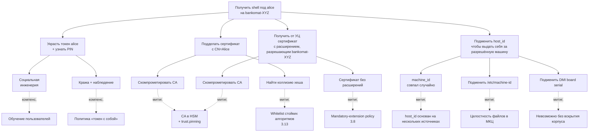

# Модель угроз pam_certauth

Каждая угроза сопровождается ссылкой на источник evidence: путь к коду,
имя поля в конфиге или ссылка на тест, доказывающий заявленное свойство.

## 1. Введение

### 1.1 Целевой объект (TOE)

Под `pam_certauth` понимается:

- PAM-модуль `libpam_certauth.so` (cdylib);
- демон `pam-certauth-monitord` (бинарь);
- крейты ядра `pam_certauth_core` и протокола `pam_certauth_proto`;
- поставочные конфигурационные файлы `dist/config/*.example`;
- systemd-юнит и tmpfiles-сниппет;
- скрипт интеграции `dist/scripts/integrate-pam.sh`.

В TOE **не входят:**

- ядро Astra Linux SE;
- libpam, libssl3, libudev, libdbus, libsystemd;
- `gost-engine` (отдельное СКЗИ ФСБ);
- PKCS#11-модули вендоров токенов (отдельные СКЗИ ФСБ);
- пользовательские хуки, прописанные в `[[hooks]]`;
- Inkscape, fly-dm, gdm и прочие потребители PAM.

## 2. Допущения о развёртывании

| #   | Допущение                                                                                  | Почему важно                                                                            |
|-----|--------------------------------------------------------------------------------------------|------------------------------------------------------------------------------------------|
| 2.1 | Машина физически защищена (МКЦ Astra или эквивалент).                                       | Без МКЦ root-компрометация → бесполезность модуля.                                       |
| 2.2 | Целостность системы на момент установки контролируется (МКЦ + verified boot, если есть).   | Подмена `gost-engine.so` или `libpam_certauth.so` обходит модуль.                         |
| 2.3 | CA-инфраструктура работает корректно: ключи в HSM, выпуск контролируется регламентом.      | Компрометация CA private key → катастрофическая компрометация контура.                  |
| 2.4 | PIN-коды пользователей не разглашаются, не записываются на бумаге у компьютера.            | PIN — единственная защита токена при физическом доступе.                                |
| 2.5 | Сертификаты выпускаются УЦ с обязательными расширениями `pam_cert_host_binding` и `pam_cert_user_binding`. | Без расширений сертификат не авторизует ни одного пользователя ни на одном хосте — fail-closed. |
| 2.6 | Администратор имеет «backup-tty» во время правки PAM-стека.                                | Защита от lockout при ошибочной конфигурации.                                            |
| 2.7 | Резервный пользователь с парольной аутентификацией не удалён.                              | Lockout-prevention при сбое в `pam_certauth`.                                            |

## 3. Угрозы, ОТ КОТОРЫХ модуль защищает

Каждая угроза описана по схеме: описание → STRIDE-категория →
mitigation → evidence (код, конфиг, тест).

### 3.1 Подбор пароля

- **Описание:** атакующий пытается перебрать пароль локального
  пользователя.
- **STRIDE:** Spoofing.
- **Mitigation:** парольной аутентификации `pam_certauth` не
  реализует. Любая попытка ввода пароля проваливается на этапе
  `pam_conv`.
- **Evidence:** в [`crates/pam_certauth/src/entry.rs`](../crates/pam_certauth/src/entry.rs)
  отсутствует вызов `pam_authtok_get`. Аутентификация идёт через
  challenge-response с приватным ключом
  ([`crates/pam_certauth_core/src/challenge/`](../crates/pam_certauth_core/src/challenge/)).

### 3.2 Утечка пароля при подсматривании / фишинге

- **Описание:** plain text password leakage.
- **STRIDE:** Information Disclosure.
- **Mitigation:** пароля нет (см. 3.1). PIN токена не передаётся в
  PAM-стек и в журналы.
- **Evidence:** [`crates/pam_certauth_core/src/secret.rs`](../crates/pam_certauth_core/src/secret.rs)
  — обёртка `Secret<T: Zeroize>` зануляет PIN при `Drop`.
  PIN никогда не передаётся как форматный аргумент tracing-макроса
  (см. также [`crates/pam_certauth_core/src/pkcs12/`](../crates/pam_certauth_core/src/pkcs12/)).

### 3.3 Копирование сертификата с USB-носителя

- **Описание:** атакующий копирует `.p12` с чужого USB и пытается
  использовать его на своей машине.
- **STRIDE:** Spoofing.
- **Mitigation (Mode A):** `.p12` зашифрован парольной фразой; без
  фразы дешифровка невозможна. Mode A считается режимом «средней»
  защиты — для production применяется Mode B.
- **Mitigation (Mode B):** ключ non-extractable. Тест проверяет
  атрибуты `CKA_EXTRACTABLE = false`.
- **Evidence:** тест
  [`crates/pam_certauth_core/tests/pkcs11_hardware_negative.rs`](../crates/pam_certauth_core/tests/pkcs11_hardware_negative.rs)
  + [`pkcs11_integration.rs`](../crates/pam_certauth_core/tests/pkcs11_integration.rs).

### 3.4 Использование чужого токена без знания PIN

- **Описание:** атакующий получил токен (украл/подобрал на стуле), но
  PIN не знает.
- **STRIDE:** Spoofing.
- **Mitigation:** PIN-prompt через PAM conversation; после `N`
  неудачных попыток (`pkcs11_max_pin_attempts`, default `3`) модуль
  отказывает. После `N` попыток на самом токене — он блокируется на
  уровне аппаратного счётчика.
- **Evidence:** тест
  [`crates/pam_certauth_core/tests/pin_loop.rs`](../crates/pam_certauth_core/tests/pin_loop.rs)
  проверяет лимит попыток.

### 3.5 Использование валидного токена на чужой машине

- **Описание:** атакующий легально владеет токеном (или украл его), но
  пытается использовать на машине, где данный токен не разрешён.
- **STRIDE:** Spoofing + Elevation of Privilege.
- **Mitigation:** проверка X.509-расширения `pam_cert_host_binding` —
  записи в нём (`*` / `sha256:<HEX>` / raw `machine_id`) сравниваются
  с `host_id_hash = sha256(host_id)` запрашивающей машины. Если ни
  одна запись не совпала — `PAM_AUTH_ERR` (`HostNotAllowed`). Само
  расширение защищено подписью сертификата CA — изменить его без
  компрометации CA нельзя.
- **Evidence:**
  - реализация — модули `x509::host_binding_ext` и
    `verify_cert_scope` в `pam_certauth_core::x509/`;
  - end-to-end —
    [`crates/pam_certauth/tests/auth_e2e_p12.rs`](../crates/pam_certauth/tests/auth_e2e_p12.rs).

### 3.6 Использование сессии после ухода пользователя

- **Описание:** пользователь отошёл от рабочего места, не извлекая
  токен; либо извлёк, но забыл закрыть сессию.
- **STRIDE:** Tampering + Elevation of Privilege.
- **Mitigation:** мониторинг udev REMOVE-событий через monitord;
  по подтверждённому removal (с учётом `usb_removed_grace_seconds`)
  — `LockSession` или `TerminateSession` через D-Bus к logind.
- **Evidence:**
  - реализация —
    [`crates/pam_certauth_monitord/src/udev_monitor.rs`](../crates/pam_certauth_monitord/src/udev_monitor.rs),
    [`logind.rs`](../crates/pam_certauth_monitord/src/logind.rs),
    [`actions.rs`](../crates/pam_certauth_monitord/src/actions.rs);
  - тесты — [`udev_simulation.rs`](../crates/pam_certauth_monitord/tests/udev_simulation.rs),
    [`udev_event_parse.rs`](../crates/pam_certauth_monitord/tests/udev_event_parse.rs);
  - тесты suspend/resume —
    [`suspend_grace.rs`](../crates/pam_certauth_monitord/tests/suspend_grace.rs).

### 3.7 Утечка приватного ключа из памяти процесса

- **Описание:** атакующий читает память процесса (через ptrace,
  /proc/pid/mem, минидамп) и пытается извлечь PIN или приватный ключ.
- **STRIDE:** Information Disclosure.
- **Mitigation:**
  - PIN хранится в `Secret<T: Zeroize>` — зануляется при `Drop`.
  - Приватный ключ в Mode B никогда не покидает токен (PKCS#11
    non-extractable).
  - В Mode A парольная фраза дешифровки используется единожды и
    обнуляется после `flow::authenticate`.
  - systemd unit ставит `NoNewPrivileges=yes`, `ProtectKernelTunables=yes`,
    `RestrictNamespaces=yes` — затрудняет ptrace со стороны.
- **Evidence:**
  - [`crates/pam_certauth_core/src/secret.rs`](../crates/pam_certauth_core/src/secret.rs)
    + Cargo.toml `zeroize = { version = "1.7", features = ["derive"] }`;
  - [`dist/systemd/pam-certauth-monitord.service`](../dist/systemd/pam-certauth-monitord.service)
    — все hardening-директивы в наличии.

### 3.8 Сертификат без расширений или с подделанным расширением

- **Описание:** атакующий пытается использовать сертификат, в котором
  расширений `pam_cert_host_binding` / `pam_cert_user_binding` нет
  совсем, либо пробует встраивать «подделанные» записи в обход УЦ.
- **STRIDE:** Tampering + Spoofing.
- **Mitigation:**
  - **Mandatory-extension policy:** отсутствие любого из расширений
    в leaf-сертификате — это безусловный отказ
    (`HostExtensionMissing` / `UserExtensionMissing` →
    `PAM_AUTH_ERR`). Никаких «мягких» fallback'ов нет.
  - **Защита подписью CA:** содержимое расширения покрыто подписью
    сертификата. Изменить запись без приватного ключа CA невозможно;
    подделать сертификат полностью — задача компрометации УЦ
    (см. 4.8).
  - **Проверка цепочки:** при выпуске сертификата нештатным
    «доверенным» CA срабатывает `[trust].anchors` + опционально
    `[trust.pinning]`.
  - **Повреждённое DER-кодирование** (мусор в `extnValue`) →
    `*ExtensionMalformed` → `PAM_AUTH_ERR`.
- **Evidence:**
  - реализация — `pam_certauth_core::x509::{host_binding_ext,
    user_binding_ext}` + `verify_cert_scope`;
  - таблица семантики — [docs/cert-issuance.md](cert-issuance.md).

### 3.9 Подмена `config.toml`

- **Описание:** атакующий с file-write правами заменяет `config.toml`
  на конфигурацию с ослабленным `[trust]` или отключённой revocation.
- **STRIDE:** Tampering.
- **Mitigation:**
  - `config.toml` не подписывается, но защищён правами `0640
    root:root` (см. [`debian/postinst`](../debian/postinst));
  - `dpkg --verify pam-certauth` обнаруживает изменение поставочных
    файлов (но не пользовательских правок `config.toml` после
    установки);
  - изменение конфига требует root-доступа — это уже вне модели угроз
    PAM-уровня.
- **Evidence:** [`debian/postinst`](../debian/postinst) +
  [`dist/tmpfiles/pam-certauth.conf`](../dist/tmpfiles/pam-certauth.conf).

### 3.10 MITM в IPC

- **Описание:** атакующий пытается подключиться к
  `/run/pam_certauth/monitord.sock` и подменять ответы.
- **STRIDE:** Tampering + Spoofing.
- **Mitigation:**
  - сокет в `/run/pam_certauth/` имеет права `0660 root:pam-certauth`
    (см. systemd `RuntimeDirectoryMode=0750`);
  - monitord проверяет peer'а через `SO_PEERCRED` —
    `uid != 0` → `Error { code: 1003 (UNAUTHORIZED) }` + разрыв.
- **Evidence:**
  - [`crates/pam_certauth_monitord/src/peercred.rs`](../crates/pam_certauth_monitord/src/peercred.rs);
  - тест [`crates/pam_certauth_monitord/tests/peercred.rs`](../crates/pam_certauth_monitord/tests/peercred.rs)
    + [`ipc_auth.rs`](../crates/pam_certauth_monitord/tests/ipc_auth.rs).

### 3.11 Replay-атаки на challenge-response

- **Описание:** атакующий, перехвативший challenge и подпись, пытается
  предъявить их повторно на новой попытке аутентификации.
- **STRIDE:** Spoofing.
- **Mitigation:** challenge генерируется свежий на каждую попытку
  через `getrandom` (16 байт) внутри cdylib (см.
  `entry.rs::fresh_session_id` и `challenge/`).
- **Evidence:**
  - [`crates/pam_certauth_core/src/challenge/`](../crates/pam_certauth_core/src/challenge/);
  - тесты — [`challenge_dispatch.rs`](../crates/pam_certauth_core/tests/challenge_dispatch.rs),
    [`challenge_rsa.rs`](../crates/pam_certauth_core/tests/challenge_rsa.rs),
    [`challenge_ecdsa.rs`](../crates/pam_certauth_core/tests/challenge_ecdsa.rs),
    [`gost_challenge_real.rs`](../crates/pam_certauth_core/tests/gost_challenge_real.rs).

### 3.12 Argv-injection в хуках

- **Описание:** атакующий подсовывает специальные символы в `pam_user`
  (или другой placeholder) с целью вызвать команду в хуке с подделанными
  аргументами.
- **STRIDE:** Elevation of Privilege.
- **Mitigation:** placeholder'ы (`${pam_user}`, `${cert_cn}`, ...)
  подставляются как отдельные argv-элементы, не через интерполяцию в
  shell. Реализация — `fork+execve`, без `system(3)`.
- **Evidence:**
  - [`crates/pam_certauth_core/src/hooks/placeholder.rs`](../crates/pam_certauth_core/src/hooks/placeholder.rs)
    + [`fork_exec.rs`](../crates/pam_certauth_core/src/hooks/fork_exec.rs);
  - тесты — [`hook_security_integration.rs`](../crates/pam_certauth_core/tests/hook_security_integration.rs),
    [`hook_executor_integration.rs`](../crates/pam_certauth_core/tests/hook_executor_integration.rs).

### 3.13 Атака слабым алгоритмом подписи

- **Описание:** атакующий выпускает (или находит существующий)
  сертификат с подписью SHA-1/MD5/RSA-1024.
- **STRIDE:** Tampering.
- **Mitigation:** whitelist `[trust].allowed_signature_algorithms`
  (см. поле в [`crates/pam_certauth_core/src/config/raw.rs`](../crates/pam_certauth_core/src/config/raw.rs)).
  OID не из whitelist → `TrustError::DisallowedSignatureAlgorithm` →
  `PAM_AUTH_ERR`.
- **Evidence:**
  - [`crates/pam_certauth_core/src/x509/`](../crates/pam_certauth_core/src/x509/)
    + [`crates/pam_certauth_core/src/error.rs`](../crates/pam_certauth_core/src/error.rs);
  - тесты — [`chain_verify.rs`](../crates/pam_certauth_core/tests/chain_verify.rs),
    [`gost_chain_verify.rs`](../crates/pam_certauth_core/tests/gost_chain_verify.rs).

## 4. Угрозы, ОТ КОТОРЫХ модуль НЕ защищает

| #   | Угроза                                                                                       | Рекомендуемый компенсирующий контроль                          |
|-----|----------------------------------------------------------------------------------------------|-----------------------------------------------------------------|
| 4.1 | Rootkit / компрометация ядра                                                                 | МКЦ Astra, IMA, EDR.                                            |
| 4.2 | Физический доступ к разлоченной сессии до срабатывания grace.                                | Уменьшить `usb_removed_grace_seconds`; админ-политика.          |
| 4.3 | Извлечение ключа из токена при компрометации PIN + физический доступ к токену + спецаппарат. | Аппаратные средства токена (anti-tamper в чипе).                |
| 4.4 | Mode A с `.p12` без пароля или со слабым паролем.                                            | Не использовать Mode A на production. Применять Mode B.         |
| 4.5 | Уязвимости в `gost-engine`.                                                                  | Своевременные обновления Astra; СКЗИ ФСБ ответственно за патчи. |
| 4.6 | Side-channel атаки на токен (electromagnetic, power, timing).                                | Аппаратные anti-tamper меры.                                    |
| 4.7 | Социальная инженерия (отдать токен и сообщить PIN).                                          | Обучение, политика.                                             |
| 4.8 | Компрометация УЦ (CA private key утёк).                                                      | HSM для CA, разделение ролей; `[trust.pinning]` ограничивает blast radius до уровня pinned-roots. |
| 4.9 | Уязвимости в `libpam`, `libssl3`, ядре.                                                      | Apt-обновления, CVE-мониторинг.                                 |

## 5. Поверхность атаки

| #   | Поверхность                            | Защита                                                                              |
|-----|----------------------------------------|--------------------------------------------------------------------------------------|
| 5.1 | PAM-стек (`/etc/pam.d/*`)              | Стандартная безопасность PAM; интегрируется через `@include certauth`.                |
| 5.2 | `libssl3` / `libcrypto`                | Системные обновления через apt.                                                       |
| 5.3 | PKCS#11-модуль (Рутокен / JaCarta)     | СКЗИ ФСБ; closed-source; доверяем при наличии действующего сертификата.               |
| 5.4 | udev-события                           | Не аутентифицированы, но мы внутри kernel-namespace и доверяем udev.                  |
| 5.5 | IPC-сокет `/run/pam_certauth/monitord.sock` | `SO_PEERCRED uid=0` + права `0660`. Если root уже компрометирован — модуль уже бесполезен. |
| 5.6 | Хуки в `[[hooks]]`                     | Whitelist placeholder'ов, fork+execve, таймауты. Сам хук — ответственность администратора. |
| 5.7 | Конфигурационные файлы `/etc/pam_certauth/config.toml` и trust-anchors | Права `0640 root:root`. Ручное управление. |

## 6. Модель нарушителя

| Уровень | Описание                                                                  | Ожидание модуля                |
|---------|---------------------------------------------------------------------------|--------------------------------|
| Н1      | Внешний нарушитель без физического доступа, без токена, без PIN.          | Ноль успехов.                  |
| Н2      | Внешний нарушитель добыл токен, но не знает PIN.                          | Ноль (защита PIN-кодом + лимит попыток). |
| Н3      | Внутренний нарушитель: легитимный пользователь пытается использовать токен на запрещённой машине или для чужого PAM-пользователя. | Ноль (host_binding + user_binding в расширениях, защищённых подписью CA). |
| Н4      | Внутренний нарушитель: администратор с root-доступом.                     | **Не моделируется** — admin доверен по построению. |

## 7. Атак-tree для угрозы 3.5 «использование валидного токена на чужой машине»

## 8. Список тестов, доказывающих заявленные защиты

| Угроза | Тест(ы)                                                | Файл                                                                    |
|--------|--------------------------------------------------------|-------------------------------------------------------------------------|
| 3.3    | non-extractable check                                   | `crates/pam_certauth_core/tests/pkcs11_hardware_negative.rs`             |
| 3.3    | PKCS#12 wrong password                                  | `crates/pam_certauth_core/tests/pkcs12.rs`                                |
| 3.4    | PIN attempt limit                                       | `crates/pam_certauth_core/tests/pin_loop.rs`                              |
| 3.5    | host_binding mismatch (sha256-запись не совпала)        | `crates/pam_certauth_core/tests/verify_cert_scope.rs`                     |
| 3.5    | end-to-end auth с расширениями host/user binding         | `crates/pam_certauth/tests/auth_e2e_p12.rs`                               |
| 3.6    | USB removal → grace → lock                              | `crates/pam_certauth_monitord/tests/udev_simulation.rs`                  |
| 3.6    | suspend/resume игнорирует transient REMOVE              | `crates/pam_certauth_monitord/tests/suspend_grace.rs`                    |
| 3.7    | Secret zeroization в Drop                                | юнит-тесты в `crates/pam_certauth_core/src/secret.rs`                    |
| 3.8    | сертификат без расширений → отказ                        | `crates/pam_certauth_core/tests/verify_cert_scope.rs` (negative-кейсы)   |
| 3.10   | uid≠0 peer отвергается                                  | `crates/pam_certauth_monitord/tests/peercred.rs` + `ipc_auth.rs`         |
| 3.11   | challenge не повторяется                                 | `crates/pam_certauth_core/tests/challenge_dispatch.rs`                   |
| 3.12   | argv-injection невозможен                                | `crates/pam_certauth_core/tests/hook_security_integration.rs`            |
| 3.13   | weak signature → DisallowedSignatureAlgorithm           | `crates/pam_certauth_core/tests/chain_verify.rs`                          |
| 3.13   | ГОСТ chain verify (реальный engine)                     | `crates/pam_certauth_core/tests/gost_chain_verify_real.rs`                |
| Reproducibility / supply-chain | reproducible build (двойная сборка) | `scripts/verify-reproducible-build.sh` |
